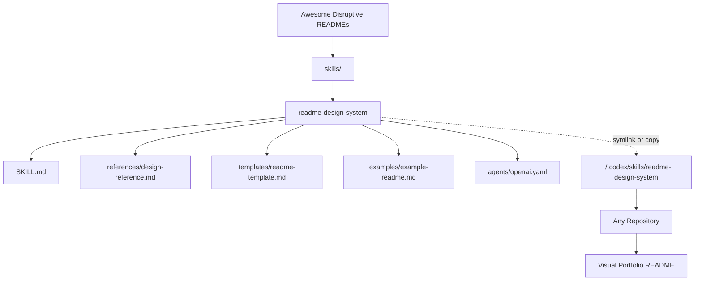

<div align="center">

# Awesome Disruptive READMEs

Reusable Codex skills for building visual, portfolio-grade GitHub documentation systems.

</div>

<p align="center">
  
  
  
  
</p>

<div align="center">

**Nicolas AI Engineering Lab**<br>
AI Engineering - Software Architecture - Cloud - Agent Systems

</div>

## Overview

`Awesome-disruptive-readmes` is a personal Codex skill catalog focused on reusable documentation systems.

The repository stores skills that can be installed globally and reused across projects. Its first skill, `readme-design-system`, turns regular repository documentation into visual technical landing pages with consistent branding, architecture storytelling, and professional portfolio structure.

> Visual asset note: this repo does not include `assets/banner.png` yet. The recommended next step is to create a dark engineering banner using the Nicolas AI Engineering Lab palette.

## Problem

Most repositories fail to communicate their real engineering value.

<table>
<tr>
<td width="50%">

### Flat Documentation

READMEs often become setup notes, generic descriptions, or incomplete placeholders.

</td>
<td width="50%">

### Hidden Engineering

Architecture, decisions, tradeoffs, and learning are usually buried or missing completely.

</td>
</tr>
</table>

## Solution

This repository keeps documentation design as reusable agent knowledge.

Instead of manually rewriting README standards in every project, install the skill once and let Codex apply the same visual system across repositories.

<table>
<tr>
<td width="50%">

### Reusable Skill System

Each skill is a standalone folder with a `SKILL.md`, optional references, templates, examples, and assets.

</td>
<td width="50%">

### Portfolio-Grade Output

The README system generates hero sections, badges, cards, Mermaid diagrams, visual roadmaps, and professional author footers.

</td>
</tr>
</table>

## Included Skill

### `readme-design-system`

A visual README design framework for creating technical landing pages.

| Capability | Description |
|---|---|
| Hero section | Centered project title, positioning statement, and optional banner |
| Badge bar | Consistent Shields.io badges using the brand palette |
| Visual cards | HTML/Markdown cards for features, modules, and learning outcomes |
| Architecture | Mermaid diagrams plus component and data-flow explanations |
| Storytelling | Problem, solution, decisions, lessons, and future improvements |
| Category adaptation | AI, Agent, Cloud, Full Stack, and Documentation/Skill projects |

Location:

```txt
skills/readme-design-system/
```

## Before vs After

| Before | After |
|---|---|
| Generic README templates | Technical landing-page documentation |
| Repeated manual prompts | Versioned reusable Codex skill |
| Hidden architecture | Mermaid diagrams and component responsibilities |
| Inconsistent repo identity | Nicolas AI Engineering Lab visual system |
| Flat project explanation | Engineering storytelling and roadmap |

## Architecture



### Component Responsibilities

| Component | Responsibility |
|---|---|
| `SKILL.md` | Main activation metadata and execution rules for the agent |
| `references/` | Detailed visual patterns, badge mapping, banner prompt, Mermaid rules |
| `templates/` | Reusable README skeleton for future generation |
| `examples/` | Compact example of the expected visual style |
| `agents/openai.yaml` | UI-facing metadata for skill discovery |

### Technical Decisions

- Keep the repo as the source of truth.
- Install skills globally by symlink when possible.
- Use ASCII-safe examples where Windows tooling may have encoding issues.
- Prefer visual clarity over decoration: fewer stronger visual blocks, not noisy Markdown.

## How It Works

Codex discovers skills through their metadata first:

```md
---
name: readme-design-system
description: Create or improve highly visual, portfolio-grade GitHub README landing pages...
---
```

When a user asks for README design, portfolio documentation, or visual repository presentation, Codex loads the skill body and follows its workflow.

## Installation

### 1. Clone the repository

```powershell
git clone https://github.com/NicolasHoyosDevss/Awesome-disruptive-readmes.git
cd Awesome-disruptive-readmes
```

### 2. Create the global Codex skills directory

```powershell
New-Item -ItemType Directory -Force "$env:USERPROFILE\.codex\skills"
```

### 3. Install with a symbolic link

```powershell
New-Item -ItemType SymbolicLink `
  -Path "$env:USERPROFILE\.codex\skills\readme-design-system" `
  -Target "$PWD\skills\readme-design-system"
```

This is the recommended approach because this repo remains the source of truth. Any change made here is immediately available to Codex.

### Alternative: copy the skill

```powershell
Copy-Item `
  -Recurse `
  -Force `
  "$PWD\skills\readme-design-system" `
  "$env:USERPROFILE\.codex\skills\readme-design-system"
```

Copying is simpler, but updates are manual.

## Usage

Open Codex in any repository and ask naturally:

```txt
Use the readme-design-system skill and create a visual landing-page README for this repository.
```

Or:

```txt
Apply the Nicolas AI Engineering Lab README design system to this repo.
```

Codex should inspect the repository, classify the project, and generate a README using the visual system.

## Project Structure

```txt
Awesome-disruptive-readmes/
|-- README.md
`-- skills/
    `-- readme-design-system/
        |-- SKILL.md
        |-- agents/
        |   `-- openai.yaml
        |-- assets/
        |-- examples/
        |   `-- example-readme.md
        |-- references/
        |   `-- design-reference.md
        `-- templates/
            `-- readme-template.md
```

## Skill Folder Standard

Future skills should follow this structure:

```txt
skills/
`-- skill-name/
    |-- SKILL.md
    |-- agents/
    |   `-- openai.yaml
    |-- references/
    |-- templates/
    |-- examples/
    |-- scripts/
    `-- assets/
```

Required:

- `SKILL.md`

Recommended when useful:

- `agents/openai.yaml` for UI metadata
- `references/` for detailed guidance
- `templates/` for reusable output skeletons
- `examples/` for expected style
- `scripts/` for repeatable automation
- `assets/` for reusable visual or output files

## Roadmap

| Stage | Status | Focus |
|---|---|---|
| Repository foundation | Done | GitHub repo, root README, first skill |
| Visual README system | In progress | Hero, cards, badges, Mermaid, templates |
| Global installation flow | In progress | Symlink/copy workflow documented |
| Automation scripts | Planned | Install and validate all skills |
| Visual assets | Planned | `assets/banner.png` and brand graphics |
| Skill catalog expansion | Planned | More reusable Codex skills |

## Lessons Learned

<table>
<tr>
<td width="50%">

### Skills Need Strong Triggers

The `description` field is not cosmetic. It controls when Codex decides to load the skill.

</td>
<td width="50%">

### Visual Systems Need Rules

A visual README is not random decoration. It needs repeatable structure, density control, and honest technical content.

</td>
</tr>
</table>

## Future Improvements

- Add `scripts/install-skills.ps1` to install every skill automatically.
- Add `scripts/validate-skills.ps1` to validate every skill folder.
- Add a real `assets/banner.png` for the repository.
- Add before/after README examples from real projects.
- Add more Codex skills for architecture docs, PR descriptions, and technical portfolios.

## Author

Built by **Nicolas Hoyos**<br>

Software Engineering - AI Engineering - Software Architecture<br>

> Building intelligent systems, scalable architectures, and practical AI products.
