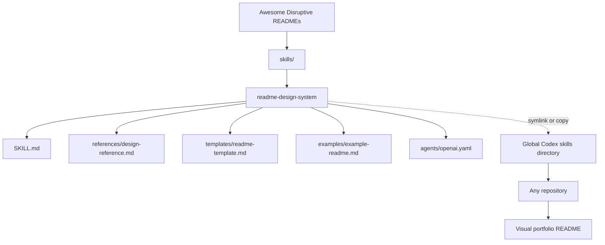
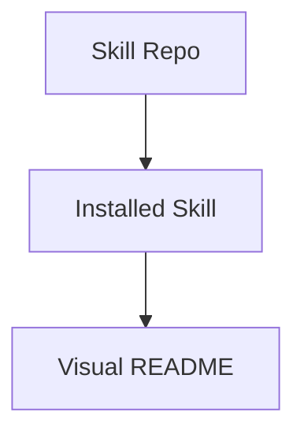

<div align="center">

# Awesome Disruptive READMEs

Reusable Codex skills for creating visual, portfolio-grade GitHub READMEs with a consistent AI Engineering identity.

</div>

<p align="center">
  
  
  
  
</p>

<div align="center">

<strong>Nicolas AI Engineering Lab</strong><br>
AI Engineering - Software Architecture - Cloud - Agent Systems<br>
<sub>Building reusable documentation systems for technical portfolios and agent-assisted engineering workflows.</sub>

</div>

---

## Overview

`Awesome-disruptive-readmes` is a Codex skill catalog and a live example of the README style it promotes.

The repository stores reusable skills that can be installed globally and applied across projects. Its first skill, `readme-design-system`, teaches Codex how to create README files that look like modern technical landing pages instead of flat setup notes.

> Visual asset note: this repo does not include `assets/banner.png` yet. A future banner should use the dark engineering palette: `#0D1117`, `#58A6FF`, `#8B5CF6`, `#C9D1D9`.

## What This Repository Gives You

<table>
<tr>
<td width="50%">

### Visual README System

A reusable Codex skill that generates hero sections, badges, cards, architecture diagrams, project structure, roadmap, and author footer.

</td>
<td width="50%">

### Consistent AI Engineering Identity

A repeatable Nicolas AI Engineering Lab style for making multiple repositories feel connected, professional, and portfolio-ready.

</td>
</tr>
<tr>
<td width="50%">

### Skill-Based Reuse

Instead of copying prompts between repos, install the skill once and let Codex load the documentation rules when README work is requested.

</td>
<td width="50%">

### Real Example Repository

This README is intentionally written as an example of the same visual system the skill is designed to produce.

</td>
</tr>
</table>

## Problem

Most repositories hide their engineering value behind flat documentation.

<table>
<tr>
<td width="50%">

### The Usual Result

- Generic README templates
- Weak visual hierarchy
- Missing architecture
- Inconsistent personal branding
- Little evidence of engineering decisions

</td>
<td width="50%">

### The Real Cost

A strong project can look unfinished when its README does not explain the system, the tradeoffs, and the learning behind it.

</td>
</tr>
</table>

## Solution

This repo turns README design into reusable agent knowledge.

The `readme-design-system` skill gives Codex a documented visual framework: inspect the repository, classify the project, generate honest technical storytelling, and present it with a consistent landing-page structure.

## Before vs After

| Before | After |
|---|---|
| README as a plain text file | README as a technical landing page |
| Repeated manual prompt writing | Reusable Codex skill installed once |
| Hidden architecture | Valid Mermaid diagrams and component tables |
| Disconnected repository identity | Nicolas AI Engineering Lab visual system |
| Generic feature list | Problem, solution, decisions, learning, roadmap |

## Included Skill

### `readme-design-system`

A visual README design framework for creating portfolio-grade technical documentation.

<table>
<tr>
<td width="50%">

### Visual Structure

Hero, badge bar, identity block, HTML cards, visual roadmap, and professional footer.

</td>
<td width="50%">

### Technical Communication

Architecture diagrams, component responsibilities, project structure, technical decisions, and lessons learned.

</td>
</tr>
<tr>
<td width="50%">

### Category Adaptation

Adapts READMEs for AI, Agent, Cloud, Full Stack, Documentation/Skill, Tooling, and Hybrid projects.

</td>
<td width="50%">

### Truthful Output

Forces the agent to avoid fake metrics, invented architecture, empty marketing, and unsupported claims.

</td>
</tr>
</table>

Location:

```txt
skills/readme-design-system/
```

## Architecture



### Component Responsibilities

| Component | Responsibility |
|---|---|
| `SKILL.md` | Main activation metadata and non-negotiable README generation rules |
| `references/design-reference.md` | Badge colors, hero pattern, card pattern, Mermaid rules, banner guidance |
| `templates/readme-template.md` | Reusable visual README skeleton |
| `examples/example-readme.md` | Compact example of the expected output style |
| `agents/openai.yaml` | UI-facing skill metadata |

### Technical Decisions

- Keep this repo as the source of truth for reusable skills.
- Install skills globally with a symlink when possible.
- Require valid fenced Mermaid blocks for diagrams.
- Use cards to reduce scanning effort without turning the README into decoration.
- Keep future work clearly marked instead of pretending features already exist.

## Visual README Patterns

<table>
<tr>
<td width="50%">

### Hero

```md
<div align="center">

# Project Name

Short technical positioning statement.

</div>
```

</td>
<td width="50%">

### Badges

```md
<p align="center">
  
</p>
```

</td>
</tr>
<tr>
<td width="50%">

### Cards

```md
<table>
<tr>
<td width="50%">

### Capability

Description.

</td>
</tr>
</table>
```

</td>
<td width="50%">

### Mermaid

````md

````

</td>
</tr>
</table>

### Before vs After Pattern

| Before | After |
|---|---|
| Flat documentation | Visual technical storytelling |
| Hidden structure | Architecture and project structure |
| Manual repetition | Reusable skill-driven workflow |

## Tech Stack

<p align="center">
  
  
  
  
</p>

| Category | Used For |
|---|---|
| Markdown | README content and skill instructions |
| YAML | Skill frontmatter and agent metadata |
| Mermaid | GitHub-rendered architecture diagrams |
| Shields.io | Visual badge system |
| Codex Skills | Reusable agent behavior across repositories |

## How It Works

Codex discovers skills through `SKILL.md` metadata first:

```md
---
name: readme-design-system
description: Create or improve highly visual, portfolio-grade GitHub README landing pages...
---
```

When a user asks for README design, portfolio documentation, architecture communication, or visual repository presentation, Codex loads the skill body and applies the system.

## Installation

### 1. Clone the repository

```powershell
git clone https://github.com/NicolasHoyosDevss/Awesome-disruptive-readmes.git
cd Awesome-disruptive-readmes
```

### 2. Create the global Codex skills directory

```powershell
New-Item -ItemType Directory -Force "$env:USERPROFILE\.codex\skills"
```

### 3. Install with a symbolic link

```powershell
New-Item -ItemType SymbolicLink `
  -Path "$env:USERPROFILE\.codex\skills\readme-design-system" `
  -Target "$PWD\skills\readme-design-system"
```

This is recommended because the repository remains the source of truth. Updating the skill here updates the globally installed skill automatically.

### Alternative: copy the skill

```powershell
Copy-Item `
  -Recurse `
  -Force `
  "$PWD\skills\readme-design-system" `
  "$env:USERPROFILE\.codex\skills\readme-design-system"
```

Copying is simpler, but updates are manual.

## Usage

Open Codex in any repository and ask:

```txt
Use the readme-design-system skill and create a visual landing-page README for this repository.
```

Or:

```txt
Apply the Nicolas AI Engineering Lab README design system to this repo.
```

The expected behavior is: inspect the repo, classify the project, create a truthful visual README, and show the architecture when the project structure supports it.

## Project Structure

```txt
Awesome-disruptive-readmes/
|-- README.md
`-- skills/
    `-- readme-design-system/
        |-- SKILL.md
        |-- agents/
        |   `-- openai.yaml
        |-- assets/
        |-- examples/
        |   `-- example-readme.md
        |-- references/
        |   `-- design-reference.md
        `-- templates/
            `-- readme-template.md
```

## Skill Folder Standard

```txt
skills/
`-- skill-name/
    |-- SKILL.md
    |-- agents/
    |   `-- openai.yaml
    |-- references/
    |-- templates/
    |-- examples/
    |-- scripts/
    `-- assets/
```

| Path | Purpose |
|---|---|
| `SKILL.md` | Required skill trigger metadata and instructions |
| `agents/openai.yaml` | Optional UI-facing metadata |
| `references/` | Detailed guidance loaded only when needed |
| `templates/` | Reusable output skeletons |
| `examples/` | Expected output examples |
| `scripts/` | Repeatable automation when useful |
| `assets/` | Reusable images, templates, or output files |

## Roadmap

| Stage | Status | Focus |
|---|---|---|
| Repository foundation | Done | GitHub repo, root README, first skill |
| Visual README system | In progress | Hero, cards, badges, Mermaid, templates |
| Global installation flow | In progress | Symlink/copy workflow documented |
| GitHub metadata | In progress | About text and topics |
| Automation scripts | Planned | Install and validate all skills |
| Visual assets | Planned | `assets/banner.png` and brand graphics |
| Skill catalog expansion | Planned | More reusable Codex skills |

## Lessons Learned

<table>
<tr>
<td width="50%">

### Skills Need Strong Triggers

The `description` field is not cosmetic. It controls when Codex decides to load the skill.

</td>
<td width="50%">

### Mermaid Needs Discipline

Diagrams only render on GitHub when they are inside valid fenced `mermaid` blocks. Close enough is not enough.

</td>
</tr>
<tr>
<td width="50%">

### Visual Does Not Mean Noisy

A strong README uses cards, badges, and diagrams to improve comprehension, not to decorate every line.

</td>
<td width="50%">

### Reuse Beats Repetition

A skill turns repeated documentation taste into a maintainable system that can evolve across projects.

</td>
</tr>
</table>

## Future Improvements

- Add `scripts/install-skills.ps1` to install every skill automatically.
- Add `scripts/validate-skills.ps1` to validate every skill folder.
- Add a real `assets/banner.png` for the repository.
- Add before/after README examples from real projects.
- Add more Codex skills for architecture docs, PR descriptions, and technical portfolios.

---

<div align="center">

## Author

Built by <strong>Nicolas Hoyos</strong><br>
Software Engineering - AI Engineering - Software Architecture<br><br>

<em>Building intelligent systems, scalable architectures, and practical AI products.</em>

</div>
