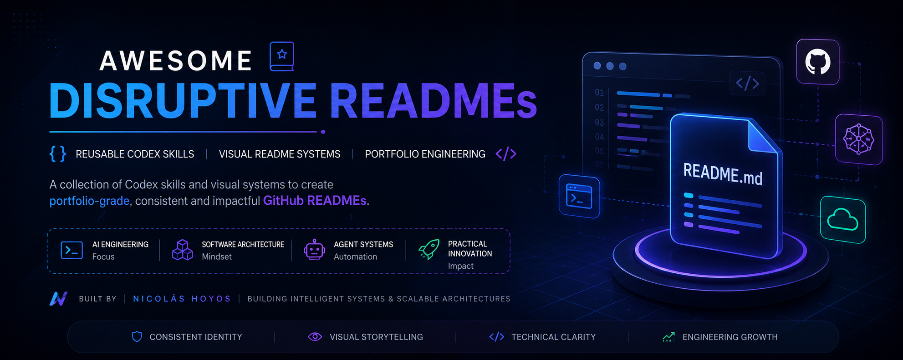
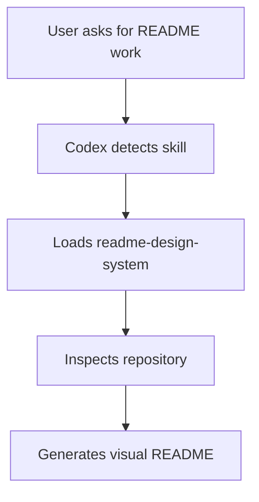

<p align="center">
  
</p>

<div align="center">

# Awesome Disruptive READMEs

Reusable Codex skills for creating visual, portfolio-grade GitHub READMEs with a consistent AI Engineering identity.

</div>

<p align="center">
  
  
  
</p>

<div align="center">

<strong>Nicolas AI Engineering Lab</strong><br>
AI Engineering - Software Architecture - Agent Systems

</div>

## What is this?

This repository is a small catalog of reusable Codex skills.

Its first skill is `readme-design-system`, a visual README framework that helps Codex create modern, portfolio-grade GitHub READMEs with consistent branding, better structure, Mermaid diagrams, badges, cards, and technical storytelling.

## Included Skill

<table>
<tr>
<td width="50%">

### `readme-design-system`

Creates visual README landing pages for repositories.

</td>
<td width="50%">

### What it improves

Hero, badges, cards, architecture, project structure, visual assets, roadmap, and footer.

</td>
</tr>
</table>

Skill path:

```txt
skills/readme-design-system/
```

## Install for all repositories

Clone this repo:

```powershell
git clone https://github.com/NicolasHoyosDevss/Awesome-disruptive-readmes.git
cd Awesome-disruptive-readmes
```

Create the Codex skills directory:

```powershell
New-Item -ItemType Directory -Force "$env:USERPROFILE\.codex\skills"
```

Recommended: install with a symbolic link:

```powershell
New-Item -ItemType SymbolicLink `
  -Path "$env:USERPROFILE\.codex\skills\readme-design-system" `
  -Target "$PWD\skills\readme-design-system"
```

Why symlink? Because this repo stays as the source of truth. When the skill changes here, Codex uses the updated version automatically.

Alternative: copy the skill manually:

```powershell
Copy-Item `
  -Recurse `
  -Force `
  "$PWD\skills\readme-design-system" `
  "$env:USERPROFILE\.codex\skills\readme-design-system"
```

## Usage

Open Codex in any repository and ask:

```txt
Use the readme-design-system skill and create a visual README for this repository.
```

Or:

```txt
Apply the Nicolas AI Engineering Lab README design system to this repo.
```

## How the skill works



## Repository Structure

```txt
Awesome-disruptive-readmes/
|-- README.md
|-- assets/
|   `-- Readme-design-system-banner.png
`-- skills/
    `-- readme-design-system/
        |-- SKILL.md
        |-- agents/
        |   `-- openai.yaml
        |-- examples/
        |   `-- example-readme.md
        |-- references/
        |   `-- design-reference.md
        `-- templates/
            `-- readme-template.md
```

## Visual Asset Guidance

The skill supports real README images when they exist.

Recommended paths:

```txt
assets/banner.png
assets/screenshots/
docs/images/
architecture/
```

If images are missing, the skill should recommend them instead of pretending they exist.

## Next Improvements

- Add an install script for all skills.
- Add validation script for all skill folders.
- Add more reusable Codex skills.
- Add examples from real repositories.

---

<div align="center">

Built by <strong>Nicolas Hoyos</strong><br>
Software Engineering - AI Engineering - Software Architecture<br><br>

<em>Building intelligent systems, scalable architectures, and practical AI products.</em>

</div>
