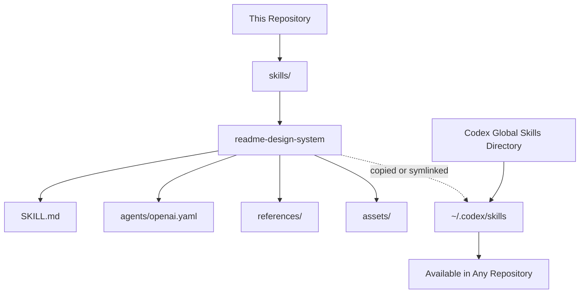

# Awesome Disruptive READMEs

Reusable Codex skills for building portfolio-grade GitHub repositories with consistent documentation, branding, and engineering storytelling.


## Project Overview

This repository is a personal skill catalog for Codex. Its purpose is to store reusable AI-agent skills that can be installed once and then used across multiple repositories.

The first skill included here is `readme-design-system`: a documentation design framework for turning repositories into professional engineering portfolio assets.

## Problem

Most GitHub repositories end up with READMEs that are either too generic, too empty, or disconnected from the actual engineering value of the project.

That creates a weak portfolio signal:

- The architecture is not visible.
- The technical decisions are not explained.
- The project does not communicate maturity.
- Each repository looks different, even when it belongs to the same personal brand.

## Solution

This repo centralizes reusable Codex skills that enforce a consistent documentation style.

Instead of rewriting README rules in every project, the skill provides Codex with a repeatable system:

- Analyze the repository before writing.
- Classify the project type.
- Apply a consistent README structure.
- Use the Nicolas AI Engineering Lab visual identity.
- Keep architecture and engineering decisions visible.
- Avoid fake metrics, fake architecture, and generic marketing text.

## Included Skills

### `readme-design-system`

Creates or improves portfolio-grade GitHub READMEs with:

- Consistent branding
- Badge strategy
- Architecture sections
- Project storytelling
- Category-specific documentation for AI, agent, cloud, and full stack projects
- Banner and asset recommendations

Location:

```txt
skills/readme-design-system/
```

## Architecture



The repository acts as the source of truth. Codex uses the installed skill from the global skills directory.

## Recommended Local Structure

```txt
Awesome-disruptive-readmes/
|-- README.md
`-- skills/
    `-- readme-design-system/
        |-- SKILL.md
        |-- agents/
        |   `-- openai.yaml
        |-- references/
        |   `-- design-reference.md
        `-- assets/
```

## Installation

### 1. Clone this repository

```powershell
git clone <REPOSITORY_URL>
cd Awesome-disruptive-readmes
```

Replace `<REPOSITORY_URL>` with the actual GitHub URL once the repository is published.

### 2. Create the Codex skills directory

```powershell
New-Item -ItemType Directory -Force "$env:USERPROFILE\.codex\skills"
```

### 3. Install the skill globally

Recommended approach: use a symbolic link.

```powershell
New-Item -ItemType SymbolicLink `
  -Path "$env:USERPROFILE\.codex\skills\readme-design-system" `
  -Target "$PWD\skills\readme-design-system"
```

This keeps the repository as the source of truth. When the skill changes in this repo, Codex uses the updated version automatically.

### Alternative: copy the skill

```powershell
Copy-Item `
  -Recurse `
  -Force `
  "$PWD\skills\readme-design-system" `
  "$env:USERPROFILE\.codex\skills\readme-design-system"
```

Copying is simpler, but updates are not automatic. If the skill changes, copy it again.

## Usage

After installation, open Codex in any repository and ask for README work naturally:

```txt
Apply my README design system to this repository.
```

Or:

```txt
Create a portfolio-grade README using the Nicolas AI Engineering Lab style.
```

Codex should detect the `readme-design-system` skill, load its instructions, inspect the repository, and generate or improve the README based on the actual project context.

## How a Skill Works

Each skill is a folder with a required `SKILL.md`.

Codex first sees only the skill metadata:

```md
---
name: readme-design-system
description: Create or improve portfolio-grade GitHub README systems...
---
```

When your request matches the description, Codex loads the full skill body and follows the instructions.

That means the description is not decoration. It is the trigger surface.

## Skill Folder Standard

Use this structure for future skills:

```txt
skills/
└── skill-name/
    ├── SKILL.md
    ├── agents/
    │   └── openai.yaml
    ├── references/
    ├── scripts/
    └── assets/
```

Required:

- `SKILL.md`

Recommended:

- `agents/openai.yaml` for UI-facing metadata
- `references/` for detailed guidance loaded only when needed
- `scripts/` for repeatable automation
- `assets/` for templates, images, examples, or files used by the skill

## Roadmap

- Add an installation script for Windows.
- Add a validation script for all skills.
- Add more documentation design skills.
- Add examples of before/after README transformations.
- Add banner assets for the Nicolas AI Engineering Lab visual identity.

## Lessons Learned

- A skill should be a reusable operating system for the agent, not a long prompt dump.
- The `description` field is critical because it controls when the skill activates.
- Keeping the repo as the source of truth and symlinking into `~/.codex/skills` avoids manual update drift.
- On Windows, ASCII-safe skill metadata/content can avoid encoding issues with some helper scripts.

## Future Improvements

- Add `scripts/install-skills.ps1` to install every skill automatically.
- Add `scripts/validate-skills.ps1` to validate every `SKILL.md`.
- Add a `docs/` section explaining how to design new skills.
- Add more reusable skill categories beyond README generation.

## Author

Built by Nicolas Hoyos

Software Engineering - AI Engineering - Software Architecture - Cloud & Agent Systems

Building intelligent systems, scalable architectures, and practical AI products.
