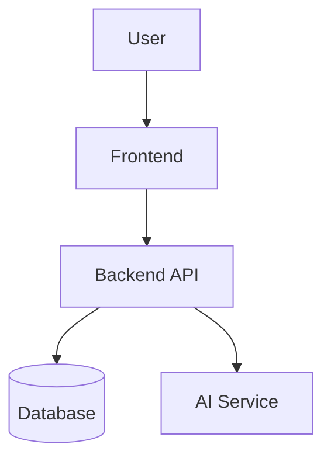

# README Design System

## Purpose

Generate README files that feel like technical landing pages, not flat documentation.

Apply the Nicolas AI Engineering Lab design system to make repositories look professional, visually consistent, technically honest, and architecture-focused.

Treat every README as:

- Product presentation
- Engineering showcase
- Technical portfolio asset
- Architecture communication layer
- Learning and decision record

Do not generate generic templates. Inspect the repository first and adapt the visual structure to the real project.

## Required Workflow

1. Inspect the repository before writing.
   - Identify project type, stack, architecture, folders, existing README, assets, and maturity.
   - Do not invent metrics, architecture, screenshots, production usage, or features.
2. Classify the project.
   - AI, Agent, Cloud, Full Stack, Documentation/Skill, Library, Tooling, Research, or Hybrid.
3. Choose a landing-page README structure.
   - Use the visual section system below.
   - Skip unsupported sections instead of filling them with empty marketing.
4. Generate a visually consistent README.
   - Use centered hero HTML, Shields.io badges, cards, Mermaid diagrams, visual tech stack, roadmap, and professional footer when appropriate.
5. Preserve technical truth.
   - Mark future work as planned.
   - Use "Not implemented yet" or "Future improvement" instead of pretending.
6. Recommend missing assets.
   - If `assets/banner.png` does not exist, include a concise banner recommendation or prompt.

## Brand Identity

Use this brand unless the repository explicitly defines another one:

- Brand: Nicolas AI Engineering Lab
- Alternative: Nicolas Software & AI Lab
- Pillars: AI Engineering, Software Architecture, Cloud Engineering, Agent Systems, Practical Innovation, Technical Research, Builder Mindset
- Tone: professional, technical, modern, clear, confident, engineering-focused

Avoid excessive marketing, buzzword overload, emoji spam, corporate cliches, and academic filler.

## Visual System

Theme: Dark engineering, modern SaaS documentation, AI engineering aesthetic, software architecture focus.

Palette:

- Background: `#0D1117`
- Primary: `#58A6FF`
- Secondary: `#8B5CF6`
- Success: `#22C55E`
- Warning: `#F59E0B`
- Text: `#C9D1D9`

Use minimal emojis only when they improve scanning. Do not decorate every heading.

## Standard Visual README Order

Use this order when applicable:

1. Banner or banner recommendation
2. Hero section
3. Badge bar
4. Identity block
5. Overview
6. Problem
7. Solution
8. Visual cards for features/highlights
9. Before vs After when useful
10. Architecture with Mermaid
11. Tech stack visual and grouped stack
12. Demo/screenshots when real assets exist
13. Installation
14. Usage
15. Project structure
16. Category-specific sections
17. Roadmap visual
18. Lessons learned
19. Future improvements
20. Author footer

## Required Visual Patterns

### Hero Section

Use centered HTML at the top:

```md
<div align="center">

# Project Name

Short, powerful technical description.

</div>
```

If `assets/banner.png` exists, place it before or after the hero:

```md
<p align="center">
  
</p>
```

If no banner exists, do not fake one. Add a short recommendation in a "Visual Assets" or "Future Improvements" section.

### Badge Bar

Use Shields.io with `style=for-the-badge` and the brand palette:

```md
<p align="center">
  
  
  
</p>
```

Keep badges useful. Prefer 3-6 badges.

### Identity Block

Include this near the top unless the repository has a different brand:

```md
<div align="center">

**Nicolas AI Engineering Lab**<br>
AI Engineering - Software Architecture - Cloud - Agent Systems

</div>
```

Use ASCII hyphens if tool compatibility matters. Use centered layout for brand consistency.

### Visual Cards

Use HTML tables when they improve scanning. Use them for features, project capabilities, architecture highlights, modules, and learning outcomes.

```md
<table>
<tr>
<td width="50%">

### Feature One

Clear technical description.

</td>
<td width="50%">

### Feature Two

Clear technical description.

</td>
</tr>
</table>
```

Do not overuse cards. Two to six cards is usually enough.

### Mermaid Diagrams

Generate valid Mermaid fenced blocks, never plain-text pseudo diagrams:

````md

````

Keep Mermaid simple enough to render on GitHub. Avoid unsupported styling unless necessary.

### Before vs After

Use when the project is a refactor, documentation system, developer tool, UX improvement, architecture improvement, or portfolio transformation:

```md
## Before vs After

| Before | After |
|---|---|
| Generic documentation | Product-like README |
| Hidden architecture | Visible system design |
| Flat explanation | Visual technical storytelling |
```

### Tech Stack Visual

Prefer `skillicons.dev` when the technologies are supported:

```md
<p align="center">
  
</p>
```

Then group technologies by category:

- Frontend
- Backend
- Database
- Cloud
- AI
- DevOps
- Testing
- Observability

Only include technologies present in the repository or explicitly marked as planned.

### Architecture Section

Include architecture when the project has meaningful structure.

The section must include:

- Mermaid diagram
- Component responsibilities
- Data or control flow
- Technical decisions
- Scalability or extension considerations

Do not invent services. If architecture is unclear, add a "Current Structure" diagram from observed folders and explain what is known.

### Project Structure

Include a concise folder tree based on the real repository:

````md
## Project Structure

```txt
project/
|-- src/
|-- docs/
|-- assets/
`-- README.md
```
````

Use ASCII trees for Windows/tooling compatibility.

### Roadmap Visual

Use a compact checklist or table:

```md
## Roadmap

| Stage | Status | Focus |
|---|---|---|
| Foundation | Done | Core structure |
| Visual System | In progress | Banner, cards, diagrams |
| Automation | Planned | Install and validation scripts |
```

Do not claim "Done" unless evidence exists.

### Footer

Close with:

```md
## Author

Built by **Nicolas Hoyos**<br>

Software Engineering - AI Engineering - Software Architecture<br>

> Building intelligent systems, scalable architectures, and practical AI products.
```

Use `Nicolas` instead of accented characters when the target tooling has known encoding limitations.

## Technical Storytelling Rules

Every README should answer these questions:

- What problem does this solve?
- Why was it built?
- How does it work?
- What engineering decisions were made?
- What did I learn?
- What would I improve?

Make the engineering growth visible. Do not just list features.

## Category Adaptation

### AI Project

Add when supported by repository evidence:

- Model Workflow
- Evaluation
- Metrics
- Limitations
- Experiments

Focus on methodology, model flow, evaluation design, and honest limitations.

### Agent Project

Add when supported:

- Agent Workflow
- Tools
- MCP Integration
- Prompt Strategy
- Orchestration Flow

Focus on reasoning flow, tool ecosystem, context management, and failure modes.

### Cloud Project

Add when supported:

- Infrastructure
- Deployment
- Cost Considerations
- Scalability
- Monitoring

Focus on reliability, operations, and architecture tradeoffs.

### Full Stack Project

Add when supported:

- Frontend
- Backend
- Database
- API Design
- UI Preview

Focus on UX, system architecture, API boundaries, and data flow.

### Documentation / Skill Project

Add when supported:

- Skill Purpose
- How It Works
- Installation
- Usage
- Folder Standard
- Examples

Focus on installability, reuse, activation triggers, and examples.

## Supporting References

Load these files only when needed:

- `references/design-reference.md`: detailed visual patterns, badge colors, banner prompts, Mermaid guidance.
- `templates/readme-template.md`: reusable landing-page README skeleton.
- `examples/example-readme.md`: compact example showing the expected visual style.

## Quality Rules

Never:

- Invent metrics
- Invent architecture
- Invent functionality
- Use too many emojis
- Generate generic READMEs
- Create empty content
- Saturate the README visually
- Hide important information inside excessive collapsibles

Always:

- Analyze project type first
- Adapt sections to the repository
- Maintain consistent visual identity
- Use reusable visual elements
- Create a technical landing-page feel
- Prioritize technical clarity
- Show architecture when possible
- Show decisions and learning
- Keep content truthful
