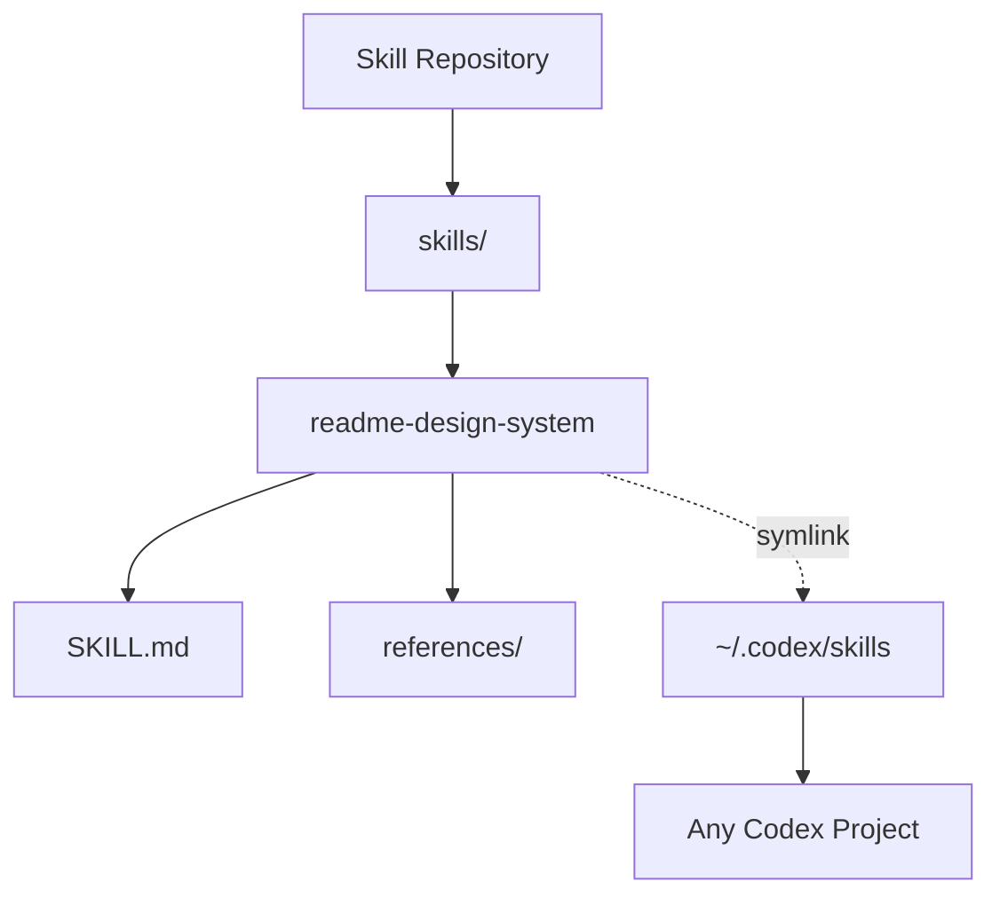

# Agent Skill Catalog

Reusable Codex skills for consistent AI-assisted engineering workflows.

  
  
  

**Nicolas AI Engineering Lab** 
AI Engineering - Software Architecture - Cloud - Agent Systems

## Overview

This repository stores reusable Codex skills that can be installed globally and used across multiple projects.

## Highlights

<table>
<tr>
<td width="50%">

### Reusable Skills

Each skill is a standalone folder with its own `SKILL.md`, metadata, references, and optional assets.

</td>
<td width="50%">

### Consistent Documentation

The README design system keeps repository presentation aligned across the portfolio.

</td>
</tr>
</table>

## Architecture

## Before vs After

| Before | After |
|---|---|
| Scattered prompts | Versioned skill system |
| Flat READMEs | Visual technical landing pages |
| Manual repetition | Reusable documentation framework |

## Author

Built by **Nicolas Hoyos** 

Software Engineering - AI Engineering - Software Architecture 

> Building intelligent systems, scalable architectures, and practical AI products.
