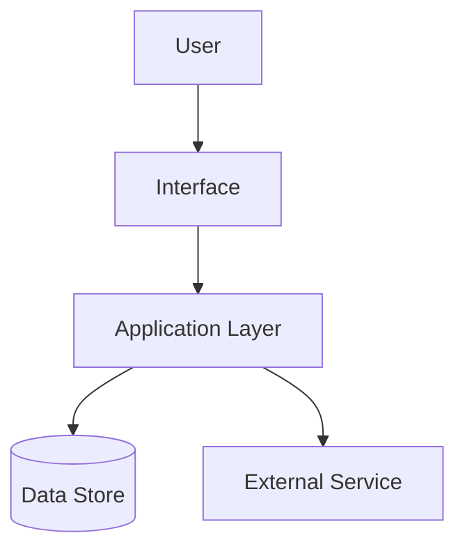

# README Design System Reference

Use this reference when a README needs stronger visual consistency or reusable landing-page patterns.

## Palette

| Purpose | Color |
|---|---|
| Background | `#0D1117` |
| Primary | `#58A6FF` |
| Secondary | `#8B5CF6` |
| Success | `#22C55E` |
| Warning | `#F59E0B` |
| Text | `#C9D1D9` |

## Badge Mapping

Use `style=for-the-badge`.

| Badge Type | Color | Example |
|---|---|---|
| Status active/done | `22C55E` | `https://img.shields.io/badge/Status-Active-22C55E?style=for-the-badge` |
| Status planned/in progress | `F59E0B` | `https://img.shields.io/badge/Status-In%20Progress-F59E0B?style=for-the-badge` |
| AI/Agent type | `8B5CF6` | `https://img.shields.io/badge/Type-Agent%20System-8B5CF6?style=for-the-badge` |
| Architecture/focus | `58A6FF` | `https://img.shields.io/badge/Focus-Architecture-58A6FF?style=for-the-badge` |
| Brand/lab | `0D1117` | `https://img.shields.io/badge/Lab-Nicolas%20AI%20Engineering%20Lab-0D1117?style=for-the-badge` |

## Hero Pattern

```md
<p align="center">
  
</p>

<div align="center">

# Project Name

Short technical positioning statement.

</div>

<p align="center">
  
  
  
</p>

<div align="center">

**Nicolas AI Engineering Lab**<br>
AI Engineering - Software Architecture - Cloud - Agent Systems

</div>
```

If `assets/banner.png` does not exist, omit the image and recommend creating it later.

## Card Pattern

```md
<table>
<tr>
<td width="50%">

### Capability One

What it does and why it matters.

</td>
<td width="50%">

### Capability Two

What it does and why it matters.

</td>
</tr>
</table>
```

Use cards for content readers scan quickly: features, modules, architecture highlights, lessons, or outcomes.

## Mermaid Rules

Mermaid must render on GitHub. Never output diagram syntax as plain text.

- Use fenced `mermaid` code blocks.
- Prefer `flowchart TD` for system architecture.
- Keep labels short.
- Avoid complex syntax that may fail on GitHub.
- Do not represent components that are not in the repo.
- Opening fence must be exactly ` ```mermaid `.
- Closing fence must be exactly ` ``` `.
- Do not indent fences.
- Do not nest Mermaid inside another code block.

Example:



## Banner Prompt Pattern

Dark modern engineering banner for "{Project Name}" by Nicolas AI Engineering Lab. Visual theme: {project category}. Include subtle architecture lines, technical grid, clean spacing, GitHub dark background `#0D1117`, blue accent `#58A6FF`, purple accent `#8B5CF6`, minimal SaaS documentation style, professional AI engineering portfolio aesthetic. No clutter, no cartoon style, no excessive icons.

## Visual Density Guard

Good visual README design is not "more graphics". Use visual blocks to clarify structure. If every section is a card, nothing stands out.

Default density:

- 1 hero
- 1 badge bar
- 1 identity block
- 1-2 card tables
- 1 Mermaid diagram
- 1 visual tech stack
- 1 roadmap table


## Visual README Patterns Section

When the repository itself is a documentation system, skill catalog, template, or design system, add a short "Visual README Patterns" section that demonstrates:

- Hero
- Badges
- Cards
- Mermaid
- Before vs After

Use cards or a compact table so the section is visual, not a wall of prose.
