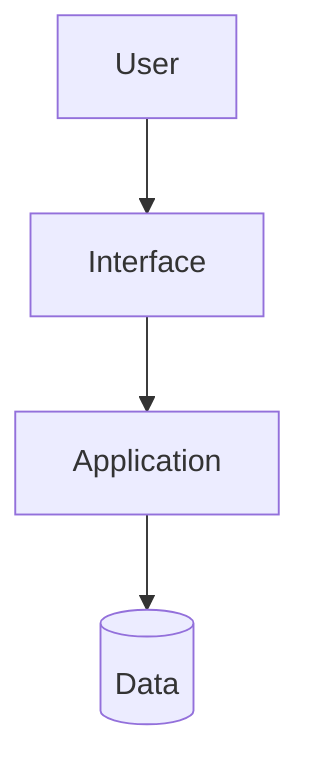

<p align="center">
  
</p>

<div align="center">

# {{PROJECT_NAME}}

{{SHORT_TECHNICAL_DESCRIPTION}}

</div>

<p align="center">
  
  
  
</p>

<div align="center">

**Nicolas AI Engineering Lab**<br>
AI Engineering - Software Architecture - Cloud - Agent Systems

</div>

## Overview

{{WHAT_THIS_PROJECT_IS}}

## Problem

{{PROBLEM}}

## Solution

{{SOLUTION}}

## Highlights

<table>
<tr>
<td width="50%">

### {{HIGHLIGHT_ONE}}

{{HIGHLIGHT_ONE_DESCRIPTION}}

</td>
<td width="50%">

### {{HIGHLIGHT_TWO}}

{{HIGHLIGHT_TWO_DESCRIPTION}}

</td>
</tr>
</table>

## Architecture



### Components

| Component | Responsibility |
|---|---|
| {{COMPONENT}} | {{RESPONSIBILITY}} |

### Technical Decisions

- {{DECISION}}

## Tech Stack

<p align="center">
  
</p>

| Category | Technologies |
|---|---|
| Frontend | {{FRONTEND}} |
| Backend | {{BACKEND}} |
| Database | {{DATABASE}} |
| Cloud | {{CLOUD}} |
| AI | {{AI}} |
| DevOps | {{DEVOPS}} |
| Testing | {{TESTING}} |

## Project Structure

```txt
{{PROJECT_FOLDER}}/
|-- src/
|-- docs/
|-- assets/
`-- README.md
```

## Roadmap

| Stage | Status | Focus |
|---|---|---|
| Foundation | {{STATUS}} | {{FOCUS}} |
| Visual System | Planned | {{FOCUS}} |
| Automation | Planned | {{FOCUS}} |

## Lessons Learned

- {{LESSON}}

## Future Improvements

- {{IMPROVEMENT}}

## Author

Built by **Nicolas Hoyos**<br>

Software Engineering - AI Engineering - Software Architecture<br>

> Building intelligent systems, scalable architectures, and practical AI products.
